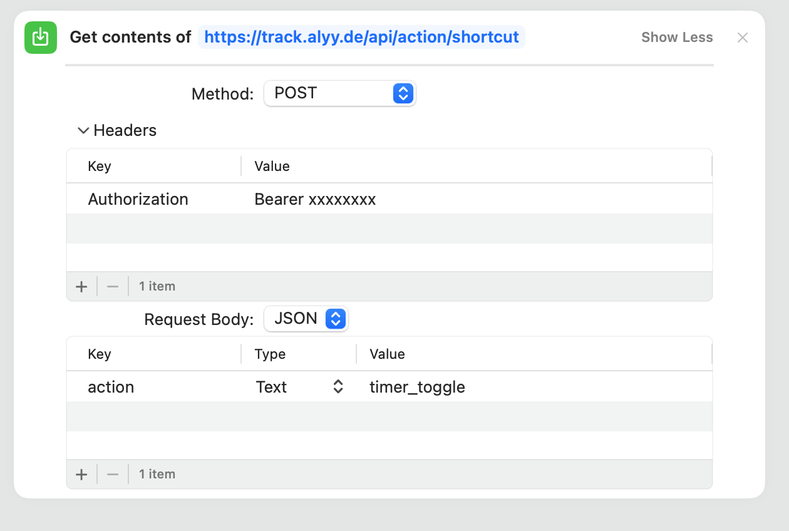
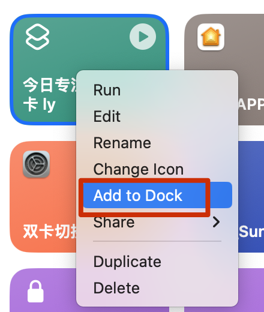

# 🚀 极致简化：一键桌面打卡与动态状态看板配置指南

通过这一指南，你完全不需要打开网页，即可在**手机桌面、电脑桌面**上使用最原生的方式进行极速打点，并时刻在光宗耀祖的动态小组件上看到自己的专注时长！

---

## 🔒 核心前置：提取安全准入密钥 (长效 Token)

为了保证你的账号和历史数据不在网络中被外泄，系统为你专门开辟了一条加密级别的独立通道。

1. 用电脑登录并刷新进入你的打卡主页：`https://track.alyy.de`
2. 点击右上角头像，选择 **「设置/资料」**
3. 滚动到模态窗口最底部，点击 **获取小组件密钥**。
4. 复制生成的这一大串密码（这是你通过苹果快捷指令与桌面组件通信的**唯一口令**，绝对不要发给他人）。

---

## 🏎️ 进阶玩法一：配置一键“神同调”快捷指令 (iOS/Mac)

我们已经为你准备好了极致化繁为简的 `timer_toggle` （智能热切换）接口：**点一次开始计时，再点一次完美保存下班！**

### 最简配置法（一键安装）✨推荐！

为了让你连配置都省去，这里已经为你打包好了配置好的标准快捷指令模板：

**👉 点击一键获取 Apple 快捷指令模板**：[**获取上下班打卡捷径**](https://www.icloud.com/shortcuts/610474ee2ae14068aede8fa27fdbced6) *(请在装有“快捷指令”App的手机或Mac上点击)*

**安装与修改步骤**：
1. 点击上方链接，选择【获取快捷指令】将它添加到你的设备中。
2. 打开该指令的【编辑】页面。
3. 找到里面唯一的“获取 URL 内容”框框，点开【头部 (Headers)】。
4. 将里面 `Authorization` 后面的值：`Bearer 这里换成自己的密串`，替换成 **你刚才在网页里复制的那个小组件密钥**。
   *(⚠️非常重要：保留前面的 `Bearer ` 和空格，只替换掉后面的中文提示部分)*
   
5. **最后一步**：在首页长按该指令或在编辑页内点击菜单，选择 **添加到主屏幕 (Add to Home Screen)**，即可在桌面享受极速单击上下班！

---

*(如果你想自己从头手动搭建，核心参数如下：*
* *URL: `https://track.alyy.de/api/action/shortcut`*
* *方法: `POST`*
* *Header: `Authorization` -> `Bearer 你的完整密钥`*
* *JSON Body: `{"action": "timer_toggle"}` )*


*🎉 从今往后，不管是在路上还是躺在床上，点一下就开始专注计时，再点一下就下班结算存入云端系统里！*

---

## 📊 进阶玩法二：iOS 桌面专注数据动态面板 (Scriptable)

快捷指令负责发包修改数据，那这套数据能不能无缝展示在桌面呢？用此脚本即可实现！

1. 在 iOS AppStore (或 Mac AppStore) 下载并且打开纯净开发者工具：**Scriptable**。
2. 点击应用首页右上角的 **`+`** 号。
3. **将下面的代码毫不犹豫地完全复制进去**。
4. **⚠️ 改动第一行**：把 `YOUR_TOKEN_HERE` 替换成你刚刚获取的密钥。
5. 保存退出，然后在手机主屏幕上长按空白处添加一个**小尺寸或中尺寸**的 Scriptable 小组件， 长按点击编辑小组件，然后script 选择刚刚创建的脚本，第二项选择运行脚本，从而选取你刚创建的脚本当面板。

### 桌面小组件定制代码

```javascript
// ==========================================
// 设定你的密钥配置
// ==========================================
// ⚠️ 极其重要：将这里替换为你系统网页里获取的10年长期密钥！
const API_TOKEN = "YOUR_TOKEN_HERE";
// ⚠️ 若你更换了域名，请将这里替换：
const BASE_URL = "https://track.alyy.de";

// ------------------------------------------
// 核心逻辑运行边界 (请尽量不要修改以下内容)
// ------------------------------------------

// 格式化时间函数
function formatDuration(seconds) {
    if (!seconds || seconds <= 0) return "0h 0m 0s";
    const h = Math.floor(seconds / 3600);
    const m = Math.floor((seconds % 3600) / 60);
    const s = Math.floor(seconds % 60);
    return `${h}h ${m}m ${s}s`;
}

// 核心拉取：利用长效 Token 安全抓取服务器你的今日数据档案
async function fetchTodayData() {
    const today = new Date().toISOString().split('T')[0];
    const req = new Request(`${BASE_URL}/api/data/checkin`);
    req.method = "GET";
    req.headers = { "Authorization": `Bearer ${API_TOKEN}` };
    
    try {
        const res = await req.loadJSON();
        if (res && res[today]) {
            return res[today];
        }
        return null;
    } catch (e) {
        return null;
    }
}

const data = await fetchTodayData();
const widget = new ListWidget();
widget.backgroundColor = new Color("#F2EFE9"); // 卡片典雅背景
widget.setPadding(15, 15, 15, 15);

// 顶部 Title
const titleStack = widget.addStack();
titleStack.layoutHorizontally();
titleStack.centerAlignContent();
const titleLabel = titleStack.addText("⏳ 今日专注看板");
titleLabel.font = Font.boldSystemFont(14);
titleLabel.textColor = new Color("#4A6FA5");
widget.addSpacer(12);

// 计算逻辑（甚至当你没有关掉遥控器时在此也能动态预测累加）
let totalSeconds = 0;
let isRunning = false;

if (data) {
    totalSeconds = data.duration || 0;
    if (data.timerRunningSince) {
        isRunning = true;
        // 把正在路上的专注时间也算进展示面板内
        const elapsed = Math.floor((Date.now() - data.timerRunningSince) / 1000);
        totalSeconds += elapsed;
    }
}

// 核心持续时间
const timeText = formatDuration(totalSeconds);
const timeLabel = widget.addText(timeText);
timeLabel.font = Font.heavySystemFont(22);
timeLabel.textColor = new Color("#8EAA90");
widget.addSpacer(10);

// 添加状态栏标签
const statusStack = widget.addStack();
statusStack.layoutHorizontally();
const statusText = isRunning ? "▶️ 正在研习爆发中" : "⏸️ 已暂停 / 休息中";
const statusLabel = statusStack.addText(statusText);
statusLabel.font = Font.mediumSystemFont(12);
statusLabel.textColor = isRunning ? new Color("#d97706") : new Color("#9ca3af");

Script.setWidget(widget);
Script.complete();
```

---

## 🤖 进阶玩法三：Android (安卓) 的极速打卡与挂件

考虑到 Android 更开放的桌面生态，你可以拥有比 iOS 更深度的自动化体验：

1. **一键打卡发包神器 —— 【HTTP Shortcuts】 (强烈推荐)**
   * 这是一套在 Android 端全免费开源的极客软件。
   * 打开软件后建立一个新捷径：
     * **方法 (Method)** 选 `POST`
     * **URL** 填 👉 `https://track.alyy.de/api/action/shortcut`
     * **Headers (请求头)** 添加一条：键为 `Authorization`，值为 `Bearer 你的完整小组件密钥`
     * **Body (请求体)** 选 JSON 或文本，填入 `{"action": "timer_toggle"}`
   * **完美体验**：你可以直接将它作为一个小巧美观的图标发送到安卓桌面，甚至可以将它常驻在你的手机下拉通知栏面板里！无需切应用，一键上下班！

2. **物理/情景自动化 —— 【Tasker / MacroDroid】**
   * 作为安卓的最强自动化软件，你可以设定各类场景。
   * 例如：“当手机连上实验室的 WiFi 时”、“当手机贴近工位上的 NFC 贴纸时”，自动对上述 URL 发送同样的 POST 网络请求，实现“连手机屏幕都不用亮，物理级无感打卡”。

3. **自由定制桌面看板 —— 【KWGT】**
   * Android 最顶级的桌面美化工具。通过添加一个 `Web Request` (网页请求)，填入 `https://track.alyy.de/api/data/checkin` 和认证头部进行抓取。
   * 你可以配合你那绝美的安卓抽屉，把 `duration` 这个专注时长变量以任何惊人的排版形态展示在主屏幕上！

---

## 💻 进阶玩法四：Windows 桌面的双击与盲按打卡

使用 Windows 操作系统的电脑时，除了点开网页，你同样可以通过极客手段实现原生打卡。

1. **写一个最简单的批处理脚本（双击打卡）**
   在你的 Windows 电脑桌面上新建一个文本文档，改名为 `一键打卡.bat`（注意后缀必须是 `.bat`），然后右键选择编辑，把下面这段标准代码粘贴进去（记得替换其中的密钥）：
   ```bat
   @echo off
   curl -X POST "https://track.alyy.de/api/action/shortcut" ^
        -H "Authorization: Bearer 这里填你的长期密钥" ^
        -H "Content-Type: application/json" ^
        -d "{\"action\": \"timer_toggle\"}"
   ```
   **大功告成**：以后每次你想进入高度专注状态，或是下班走人，只需要在桌面上双击一下这个文件，它会闪过一个黑框，并在云端为你精准记录时间！

2. **高级极客指令：一键键盘盲按打卡 (AutoHotkey)**
   如果你精通快捷键，可以下载开源小软件 **AutoHotkey**。
   配置脚本把上面的 HTTP 请求绑定在诸如 `Ctrl + Alt + T` 这种全范围无冲突的快捷键上。
   这意味着，不管你此刻在电脑上看文献、看剧还是写代码，只要盲按这三个键，不用切换任何窗口，你就悄悄在后台完成了一次完美的打卡操作！

---
🎉 **架构通用性优势：** 因为我们的核心采用了最高级也是最泛用的 JSON 标准接口（RESTful）配合长效 Token。这套“外围极客生态圈”能够完美兼容市面上的所有智能设备。尽情享受全平台打卡的快感吧！
